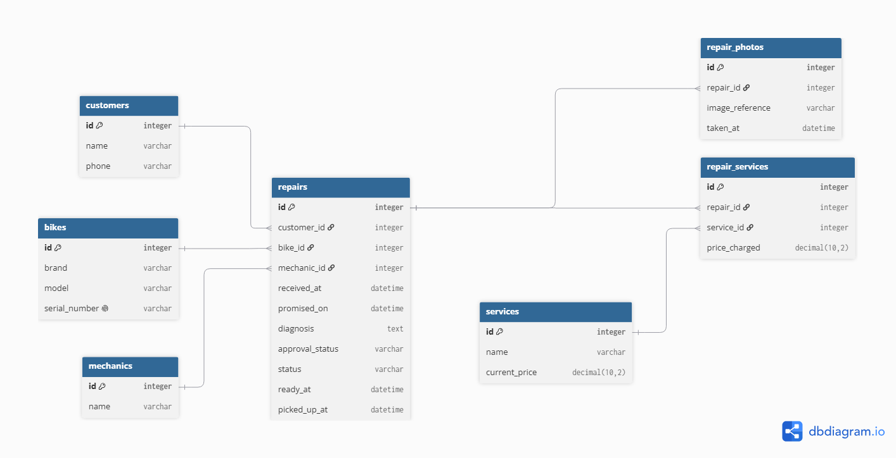

# Domain model


## Domain model code
```
Table customers {
  id integer [pk, increment]
  name varchar [not null]
  phone varchar [not null]
  created_at timestamp [not null]
  updated_at timestamp [not null]
}

Table bikes {
  id integer [pk, increment]
  customer_id integer [not null, ref: > customers.id]
  brand varchar [not null]
  model varchar [not null]
  color varchar [not null]
  serial_number varchar [not null, unique]
  created_at timestamp [not null]
  updated_at timestamp [not null]
}

Table staffs {
  id integer [pk, increment]
  name varchar [not null]
  role varchar [not null]
  created_at timestamp [not null]
  updated_at timestamp [not null]
}

Table repairs {
  id integer [pk, increment]
  bike_id integer [ref: > bikes.id]
  staff_id integer [ref: > staffs.id]

  received_at timestamp [not null]
  promised_on date

  approval_status varchar
  status varchar [not null, default: "received"]

  ready_at timestamp
  picked_up_at timestamp
  created_at timestamp [not null]
  updated_at timestamp [not null]
}

Table services {
  id integer [pk, increment]
  name varchar [not null, unique]
  current_price decimal(10,2) [not null]
  created_at timestamp [not null]
  updated_at timestamp [not null]
}

Table repair_services {
  id integer [pk, increment]
  repair_id integer [ref: > repairs.id]
  service_id integer [ref: > services.id]
  price_charged decimal(10,2) [not null]
  created_at timestamp [not null]
  updated_at timestamp [not null]
}

```
## Changes since Lab 3
- Renamed the `mechanics` table to `staffs` because Wheelhouse includes both mechanics and counter staff.
- Added `role` to `staffs` to distinguish mechanics from counter staff.
- Added `customer_id` to `bikes` because every bike must have an owner.
- Added `color` to `bikes` to identify bicycles with otherwise identical descriptions.
- Removed `customer_id` from `repairs` because the customer is obtained through the repair's bike.
- Changed `promised_on` to `date` because it represents a calendar day rather than an exact moment.
- Added `status` with a default of `received`, the first state in the repair lifecycle.
- Deleted repair photos and written diagnoses until Lab 9, as required by Lab 5.

## Repair lifecycle
### States:
The repair states are the following ones:
- received: The bike arrives at the shop. 
- diagnosing: The mechanic is determining the problem with the bike.
- awaiting approval: The shop is waiting for the customer to approve the proposed work.
- approved: The customer accept the proposed work.
- declined: The customer rejected the proposed work.
- in progress: The mechanic is repairing the bike.
- ready: The repair is complete.
- picked up: The bike left the shop.

### Allowed transitions:
- Received to diagnosing: the mechanic takes the bike and start the analysis of the bike.
- Diagnosing to awaiting approval: The mechanic report to the shop the diagnosis and send it to the customer, then the shop waits for the answer.
- Awaiting approval to approved: The customer approbe the repair to do.
- Awaiting approval to declined: The customer decline the repair to do.
- Approved to in progress: The mechanic do the repair.
- In progress to ready: The mechanic finish the repair.
- Ready to picked up: The customer pick up his repaired bike.
- Declined to picked up: The customer pick up his unrepaired bike.

### Not allowed transitions:
- Awaiting approval to in progress: The mechanic can't start the work if the customer did not approve it.
- Declined to in progress: The mechanic don't start the job if the customer rejected it.
- In progress to picked up: The customer only retires the bike if the work is finished.
- Approved to ready: The bike can't be repaired before the customer's answer.

## Entity trace table:
| Entity | User story number |
|---|---|
| Customers | 1 |
| Bikes | 1, 3 |
| Repairs | 2, 5, 9, 10, 12, 14 |
| Mechanics | 12, 13, 14 |
| Services | 6, 8, 13 |
| Repair_services | 6, 7, 13 |
| Repair_photos | 4 |


## The thing and the copy of the thing:
Each bike is stored as a separate row in "bikes" and has a unique "serial_number" who prevents the mix-up. This is prevented because each bike has the unique code, even if two bikes has the same brand and model. A single table with quantity would tell the amount of something, in the case of the bikes, it would tell how many bikes for every brand and model are, but not which one need to be repaired, which one had previously repaired, or which one is ready to pick up.

## Derived or stored?
The model does not store an overdue column. The promised_on shows the deadline to repair the bike, if the status is not completed and the promised date has passes, it is an overdue.
"Price_charged" Is stored in "repair_services" because the shop sometimes charge less than the price list due the change of the prices in January, and to prevent that the price also change for a bike that is being repaired.
